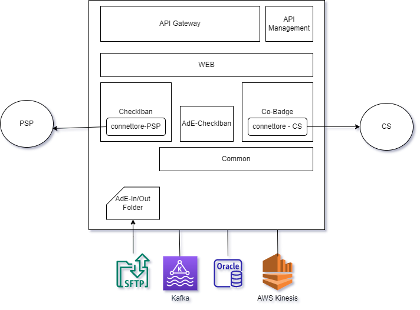
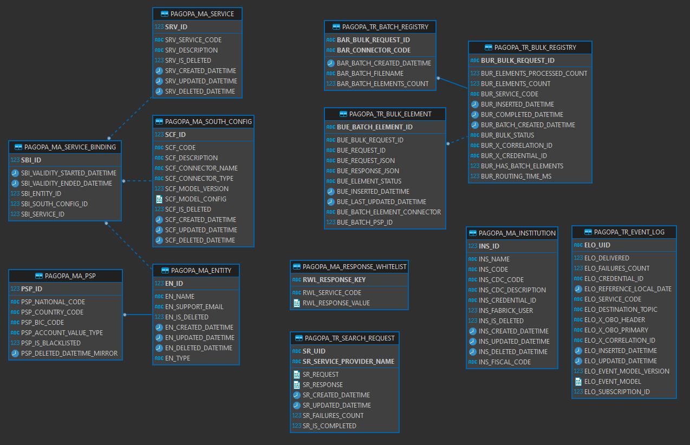
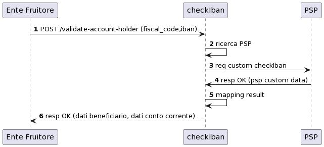
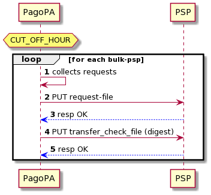
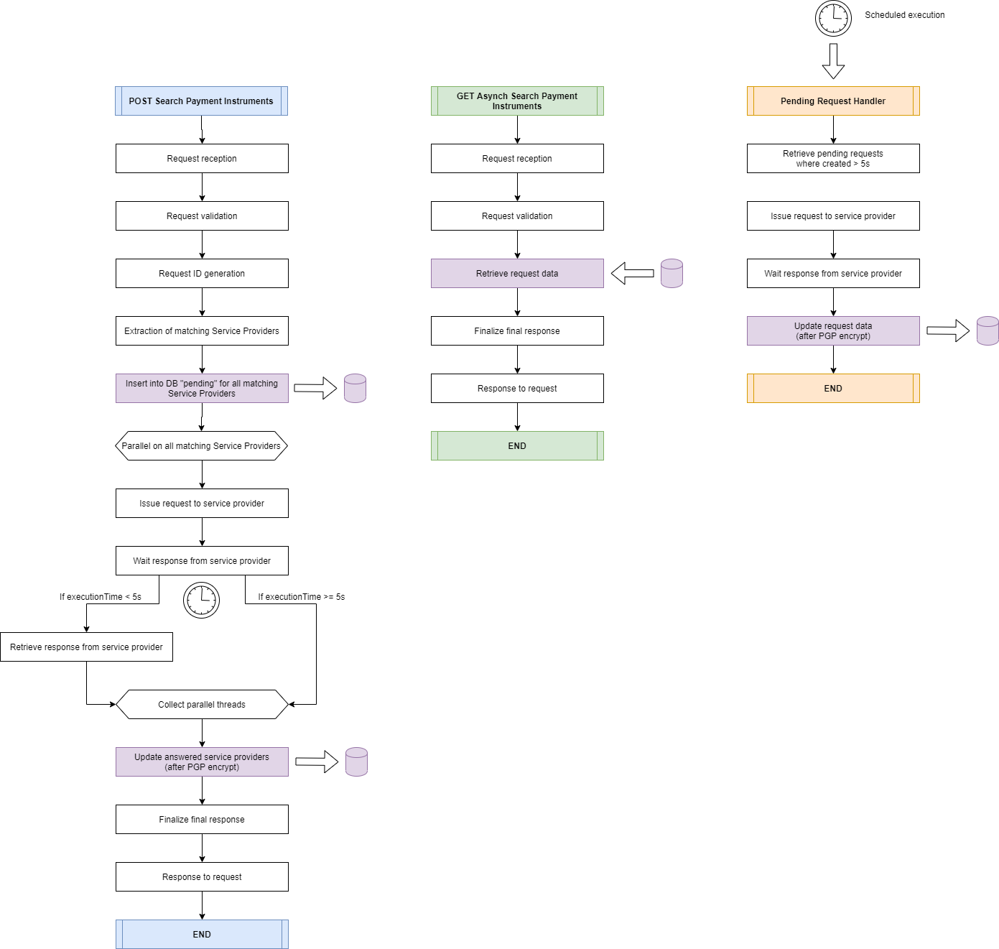

# bs-bankings-services

Template project with all the logic of banking services for PA.

Runs locally on Docker.

## Documentation
The official API documentation is available here

<https://bankingservices.pagopa.it/docs/platform/apis/pagopa-banking-v4.0>

## Recommended Requirements

* Windows 10 / MacOS
* 16 GB of RAM (your docker installation must specify at least 4GB of RAM for each container)
* Docker (tested on 20.10.21)
* Docker Compose (v2.15.1)

## Setup

First of all you need to include a
```
.env
```
file inside the 
```
bs-bankings-services\bs-banking-services-web\src\main\resources
```
folder in the web component of the project

inside, you must include a key for example like this:
```
PGP_PUBLIC_KEY=-----BEGIN PGP PUBLIC KEY BLOCK-----\nComment: Test OpenPGP ...
```
This key is used in the CoBadge service to encrypt the response, which in the real service will contain sensitive information.

## Usage

The project exposes 3 sets of APIs:
* Validate Account Holder APIs
> They carry on the functionality of check iban service.
* Payment Instruments APIs
> They perform the co badge service functionality.
* Config APIs
> They are used to configure both the check iban and co badge services; they include CRUD endpoints for the various entities present in the system (for example, the PSP).

By importing and using the *Postman Collection* committed in this repo you can test the various services exposed by the application.

Every call in the collection is an example and should not be used as documentation. All the details on the fields that can be used are in the *Swagger* that can be read from the component on the path:
```
http://localhost:8080/swagger-ui/index.html?urls.primaryName=_0-PAGOPA_CONNECTOR_ALL
```

The repo includes the following scripts to try to ease the local startup procedure of the project:
```
# Starts the docker compose process, the APIs will be exposed on port 8080
./start.sh

# Stops the docker compose process
./stop.sh

# Cleans the created containers
./clean.sh
```
The first start should take some time, because it must build all the needed containers and make sure that they're started in order (the longest part is spinning up *Oracle Express*).

When all the containers are reported as *running* then you can start using the exposed APIs locally.

## Backend Structure

Here are described the contents of each backend package:

* bs-banking-services-common

>Contains shared common classes like exceptions, enumerations and API models.


* bs-banking-services-checkiban

>Contains models and classes specific to the checkiban component, including custom logic, validators and exceptions.


* bs-banking-services-cobadge

>Contains models and classes specific to the cobadge component, including custom logic, validators and exceptions.


* bs-banking-services-web

>Contains the actual services, controllers, handlers and connectors interacting with the domain logic to carry on the APIs functionalities.

Note that all the PSPs (Payment Service Provider) connected to the service are mocked locally for demo purposes.


## Architecture

This is a pure *backend* service implemented with *Spring Boot Framework* and the *Java* programming language (JDK 8).

Furthermore, it uses *Oracle Express Edition 21* as a DB and *Zookeeper + Kafka* as a message queue to send near-realtime events to a *AWS Firestore* endpoint.

To handle distributed Locks for scheduler processes, it uses Hazelcast (In-Memory Data Grid).
Of course, this is not necessary if you run locally, but with 2 instances and up running at the same time it becomes very important.

It uses *Project Reactor*(https://projectreactor.io/) and a reactive-programming model to handle high levels of API call load.

### Components Diagram

The following section contains an high level overview of the system components and a detailed data model diagram.

#### Backend


#### Database Model


### Sequence Diagram
The following section describes the high level flow of operations for the main APIs of the BankingServices project.

#### Validate Account Holder


#### Validate Account Holder BULK


#### Search Payment Instruments


## Test Data

The following test data can be used for the services:

* POST Validate Account Holder API

```
# 00000
account.value = IT36X0000001600348957636581
accountHolder.type = PERSON_LEGAL
accountHolder.vatCode = 27255906612

# 00001
account.value = IT09T0000101600626777231345
accountHolder.type = PERSON_LEGAL
accountHolder.vatCode = 57829207877

# 00002
account.value = IT19S0000201600339261995922
accountHolder.type = PERSON_NATURAL
accountHolder.fiscalCode = MUNCPN63S02D139I
```

* POST Search Payment Instruments API
```
fiscalCode = ABCDEF12L12A123K
```
